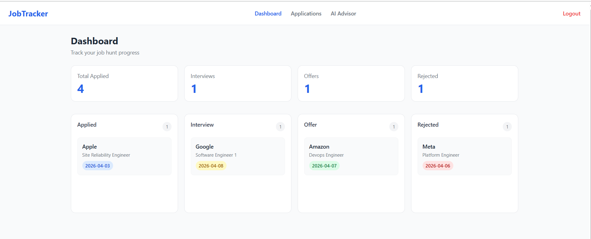
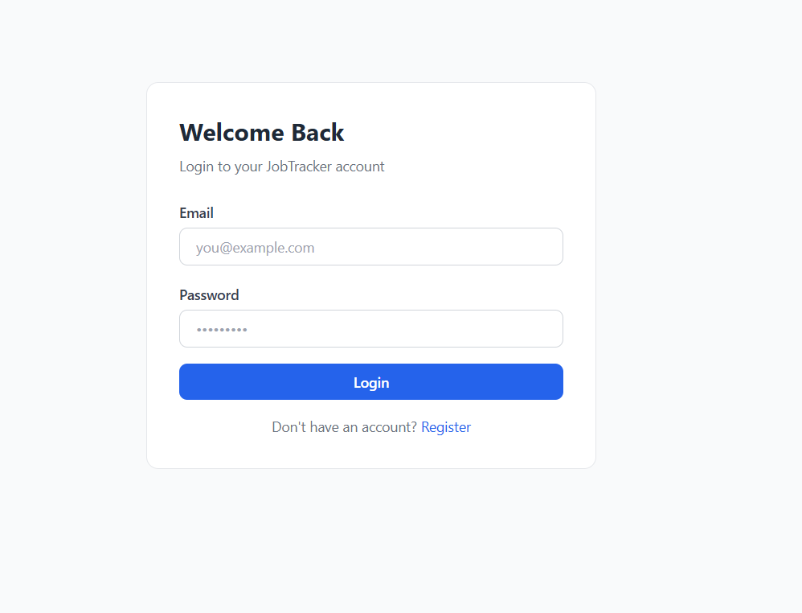
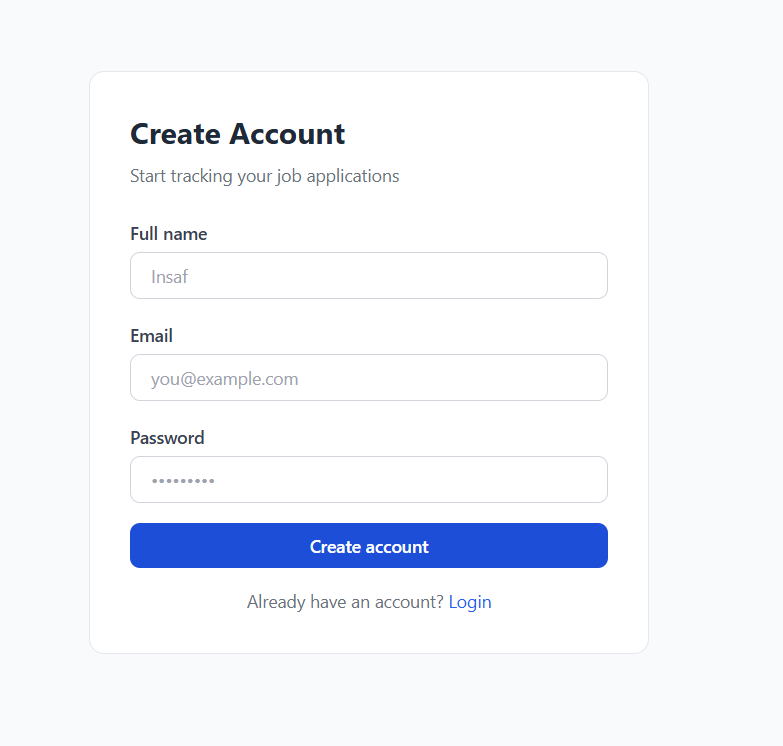
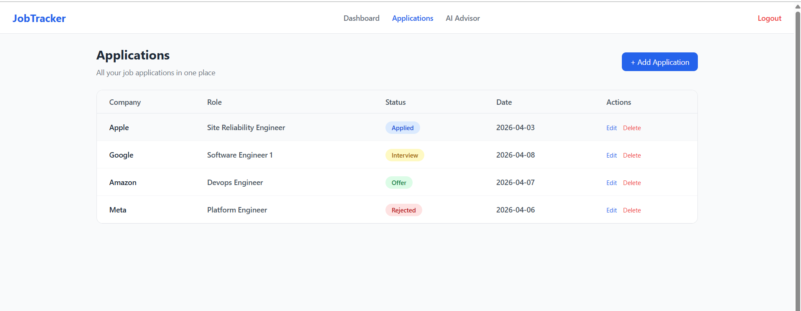
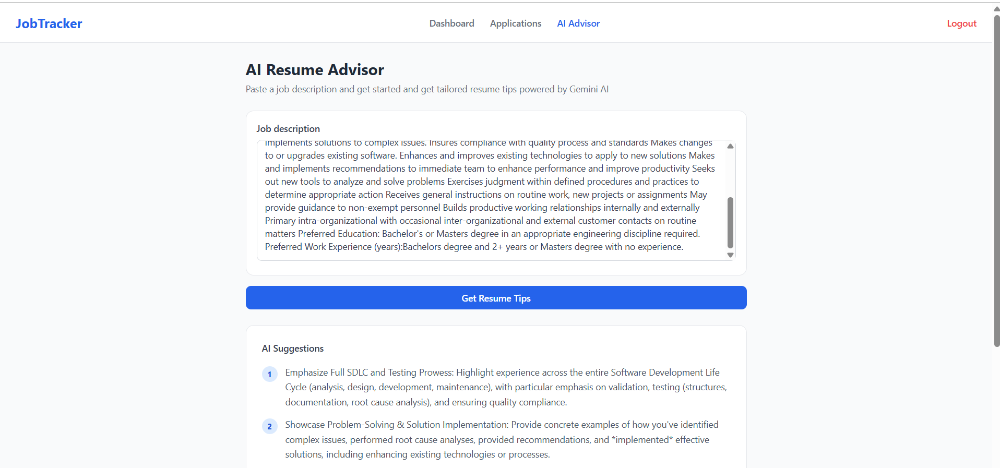

# Job Tracker — Full Stack Spring Boot + React App

A full-stack web application to track job applications with an AI-powered resume advisor.


## 🖼️ Preview



---

## Features

- JWT authentication (register, login, protected routes)
- Track job applications with status, company, role, date, and notes
- Kanban board — drag cards across Applied / Interview / Offer / Rejected
- Stats dashboard — application trends and status breakdown chart
- AI Resume Advisor — paste a job description, get tailored resume tips (Gemini API)

---

## Tech Stack

| Layer    | Technology                                            |
| -------- | ----------------------------------------------------- |
| Backend  | Spring Boot , Spring Security, Spring Data JPA       |
| Auth     | JWT (jjwt library)                                    |
| Database | PostgreSQL                                            |
| Frontend | React 18, Vite, React Router v6                       |
| State    | Context API + custom hooks                            |
| HTTP     | Axios                                                 |
| AI       | Google Gemini API                                     |

---

## 📸 Screenshots (Proof)

### 🔑 Login Page



### 📝 Register Page



### 📊 Dashboard


### 📋 Applications Page



### 🤖 AI Advisor



---

## Architecture

```
React  <-->  Spring Boot REST API   <-->  PostgreSQL
                                  |
                          Google Gemini API
```


---

## API Endpoints

| Method | Endpoint                 | Auth | Description           |
| ------ | ------------------------ | ---- | --------------------- |
| POST   | `/api/auth/register`     | No   | Create account        |
| POST   | `/api/auth/login`        | No   | Get JWT token         |
| GET    | `/api/applications`      | Yes  | List all applications |
| POST   | `/api/applications`      | Yes  | Add application       |
| PUT    | `/api/applications/{id}` | Yes  | Update application    |
| DELETE | `/api/applications/{id}` | Yes  | Delete application    |
| POST   | `/api/ai/resume-tips`    | Yes  | Get AI resume advice  |

---
